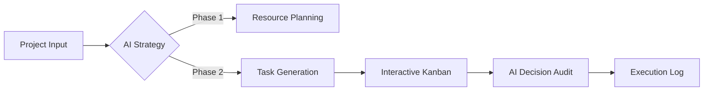

# 🚀 AI Autonomous Project Manager — Frontend

<div align="center">

### 🧠 Building the Future of AI-Driven Project Execution

**Enterprise-grade AI Project Management Interface powered by React + Vite**


[](https://react.dev)
[](https://vitejs.dev)
[](https://tailwindcss.com)
[](LICENSE)


💼 **Production Architecture • Real-World Ready • AI-First Design**

</div>

---

## ✨ Features at a Glance

| Feature | Description |
|:---|:---|
| **🎨 Premium UI** | Stunning Kanban Board with glassmorphism, smooth animations, and a polished dark/light mode system. |
| **🤖 AI Integration** | Intelligent project workflows including AI Strategic Planning, automated Task Generation, and Decision Auditing. |
| **📱 Full Responsive** | Seamless experience across all devices, from ultra-wide monitors to mobile smartphones. |
| **⚡ High Performance** | Powered by Vite 6 with aggressive code splitting and lazy loading for near-instant page transitions. |
| **🔐 Secure Auth** | Flexible authentication layer supporting Email/Password and social OAuth (Google/GitHub). |
| **🐳 DevOps Ready** | Fully Dockerized with multi-stage builds and Nginx optimization, plus automated CI/CD pipelines. |

---

## 🛠️ The Core Innovation

This platform is more than just a task tracker — it's a **Next-Generation Autonomous Framework** that bridges the gap between AI strategic thinking and project execution.

### Key Workflows:
- **Strategic AI Planner**: Convert high-level project goals into actionable 3-phase roadmaps.
- **Intelligent Decision Engine**: Audit AI decisions with alternative strategy analysis and memory persistence.
- **Enterprise Kanban**: Advanced task board with real-time status tracking and premium aesthetics.

> [!TIP]
> **Best for**: Technical Leaders, AI System Designers, and Product Managers who need an intelligent interface for autonomous workflows.

---

## 📁 Project Architecture

```bash
src/
├── api/                  # Centralized Axios interceptors & state-driven API modules
├── components/           
│   ├── layout/           # Global Sidebar, Topbar, and Theme Providers
│   └── ui/               # Reusable atomic design components
├── context/              # Authentication, Theme, and Toast global state
├── hooks/                # Custom business logic (useTasks, useProjects, etc.)
├── pages/                
│   ├── auth/             # LoginPage, RegisterPage
│   ├── projects/         # Kanban Board, Create Project Wizard
│   ├── dashboard/        # Intelligent Workspace & Metrics
│   └── ai-modules/       # Strategy Planning, Decision Audits, & AI Memory
└── styles/               # Design tokens & Global CSS variable system
```

---

## 🏗️ Technical Stack

- **Framework**: [React 19](https://react.dev) (Functional Components, Hooks)
- **Tooling**: [Vite 6](https://vitejs.dev) (Lightning fast HMR)
- **Styling**: [Tailwind CSS](https://tailwindcss.com) + [CSS Variables Design System]
- **Routing**: [React Router 7](https://reactrouter.com) (Data-aware routing)
- **API**: [Axios](https://axios-http.com) (Standardized interceptors)
- **Icons**: Custom SVG + Optimized Feather set
- **Charts**: Data visualization for AI insights

---

## 🗺️ Application Roadmap



---

## 🚀 Getting Started

### 1. Requirements
Ensure you have **Node.js 20+** and **npm** installed.

### 2. Initialization
```bash
# Clone the repository
git clone https://github.com/Prabesh666/AI-Autonomous-Web-Project-Manager-Using-Agentic-and-Generative-AI-Frontend.git

# Enter project directory
cd ai-autonomous-Frontend

# Install dependencies
npm install
```

### 3. Configuration
Create a `.env` file in the root:
```env
VITE_BACKEND_URL=https://ai-autonomous-backend.onrender.com
```

### 4. Development Launch
```bash
npm run dev
```

## 👨‍💻 Developer and Researcher 

**Prabesh Shah**


* Building autonomous and scalable systems

---

## 📄 License

Proprietary and confidential.
© 2026 AI Project Manager Inc.

---


