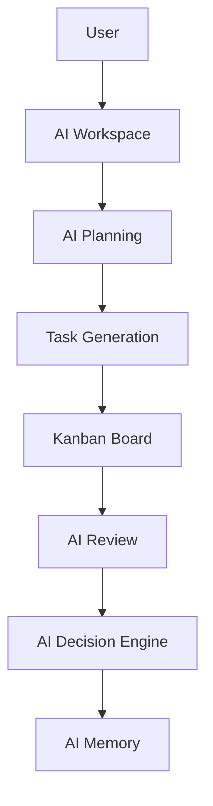

````markdown
# 🚀 AI Autonomous Project Manager — Frontend

<div align="center">

### 🧠 Building the Future of AI-Driven Project Execution

**Enterprise-grade AI Project Management Interface powered by React + Vite**


[](https://react.dev)
[](https://vitejs.dev)
[](LICENSE)


💼 **Portfolio Project • Production Architecture • Real-World Ready**

</div>

---

## 📸 Preview


| Feature | Description |
|---------|-------------|
| **15 Production Pages** | Landing, Auth, Dashboard, Kanban Tasks, AI Review, AI Decision, AI Memory, Project Creation, Settings, Profile, Activity Log, and more |
| **🌙 Dark / Light Mode** | Global CSS variable system (`--bg-main`, `--text-primary`, etc.) powers seamless theme toggling across every page |
| **📱 Mobile Responsive** | Adaptive breakpoints at `1024px`, `900px`, `768px`, `600px`, and `480px` — fully tested on all screen sizes |
| **⚡ Code Splitting** | All routes are lazy-loaded via `React.lazy()` + `<Suspense>` with a polished global `<Loader />` spinner |
| **🔐 OAuth Integration** | Google & GitHub SSO via backend Passport.js, plus standard email/password authentication |
| **🐳 Production Ready** | Optimized Vite build, multi-stage Nginx Dockerfile, GitHub Actions CI/CD pipeline |

---

## 🧠 What This Project Does

This is a **next-generation AI-powered project management frontend** that simulates how modern autonomous systems plan, analyze, and execute projects.

Instead of traditional task managers, this system introduces:

- 🤖 AI agents that **plan, review, and decide**
- 📊 Smart dashboards with **real-time insights**
- 🧠 Memory systems that **track AI decisions over time**

> ⚡ Think: *Jira + Notion + AI Agents combined into one intelligent system*

---
##


## 📁 Project Structure

```
src/
├── components/
│   ├── common/                 # Loader spinner
│   └── layout/                 # DashboardLayout (Sidebar + Topbar + Theme Toggle)
├── pages/
│   ├── auth/                   # LoginPage, RegisterPage
│   ├── landing/                # LandingPage (Hero + Features + CTA)
│   ├── dashboard/              # DashboardHome, TaskBoard, AIWorkspace
│   ├── ai-review/              # AI Review — Chat + Insights split panel
│   ├── ai-decision/            # AI Decision Agent — Recommendations + Alternatives
│   ├── ai-memory/              # AI Memory — Chronological audit timeline
│   ├── ai-states/              # AI Loading & Error state demonstrations
│   ├── projects/               # Create New AI Project wizard
│   ├── activity-log/           # Activity Log table with filters
│   ├── profile/                # User Profile with tabs
│   └── settings/               # Settings (General, Security, Billing, Danger Zone)
├── routes/                     # AppRouter — centralized route definitions
├── services/                   # apiClient.js (REST API layer)
└── index.css                   # Global design tokens (light + dark variables)
```

---

## 🗺️ Route Map

### Standalone Pages

| Route | Page | Description |
|-------|------|-------------|
| `/` | Landing Page | Hero section, feature grid, CTA, animated footer |
| `/login` | Login | Split-screen auth with Google & GitHub OAuth |
| `/register` | Register | Sign up with email, name, and password |
| `/ai-planning` | AI Workspace | 3-column AI planning interface with live chat |

### Dashboard Pages (Sidebar + Topbar Layout)

| Route | Page | Description |
|-------|------|-------------|
| `/dashboard` | Dashboard Home | Task cards, progress tracking, kanban preview |
| `/tasks` | Task Board | Full Kanban board with To-Do, In Progress, Review columns |
| `/activity-log` | Activity Log | Filterable table of all project events |
| `/profile` | Profile | User info, security settings, notification preferences |
| `/settings` | Settings | General, Security, Billing & Subscription, Danger Zone |
| `/projects/new` | Create Project | AI-powered project creation with prompt input + templates |
| `/ai-review` | AI Review | Chat timeline + project health insights sidebar |
| `/ai-decision` | AI Decision | AI recommendation card + alternative strategies grid |
| `/ai-loading` | AI Loading State | Simulated plan generation with animated stepper |
| `/ai-error` | AI Error State | Error recovery modal with retry/edit actions |
| `/ai-memory` | AI Memory | Chronological audit trail of all AI events |

---


## ✨ Key Highlights

### 🧠 AI-Driven Features
- AI Planning Workspace (chat + structured output)
- AI Review System (project health insights)
- AI Decision Engine (recommendations + alternatives)
- AI Memory Timeline (audit trail of all AI actions)

### 📊 Project Management
- Advanced Kanban Board (drag & drop ready)
- Activity Logs with filtering
- AI-powered Project Creation Flow

### 🎨 UI/UX Excellence
- 🌙 Dark / Light Mode (CSS variables)
- 📱 Fully responsive (mobile → desktop)
- 🧩 Reusable component architecture
- 🧭 Clean dashboard layout system

### ⚡ Performance & Engineering
- Route-based code splitting
- Lazy loading with Suspense
- Optimized Vite build
- Clean scalable architecture

---

## 🏗️ Architecture

```bash
src/
├── components/        # Reusable UI components
├── layout/            # Sidebar, Topbar, Layout system
├── pages/             # Feature-based pages
├── routes/            # Central routing system
├── services/          # API layer
└── styles/            # Global design system
````

### 💡 Architecture Principles

* Feature-based folder structure
* Separation of concerns
* Reusable UI system
* Scalable for enterprise apps

---

## 🗺️ Application Flow



---

## 🧪 Tech Stack

| Category   | Tech           |
| ---------- | -------------- |
| Frontend   | React 19       |
| Routing    | React Router 7 |
| Build Tool | Vite 8         |
| Styling    | CSS Variables  |
| Linting    | ESLint         |
| Deployment | Docker + Nginx |
| CI/CD      | GitHub Actions |

---

## ⚙️ Getting Started

### 1️⃣ Clone Repository

```bash
git clone https://github.com/Prabesh666/AI-Autonomous-Web-Project-Manager-Using-Agentic-and-Generative-AI-Frontend.git
cd ai-autonomous-Frontend
```

### 2️⃣ Install Dependencies

```bash
npm install
```

### 3️⃣ Setup Environment

```env
VITE_BACKEND_URL=https://ai-autonomous-backend.onrender.com
```

### 4️⃣ Run Project

```bash
npm run dev
```

👉 Runs at: **[http://localhost:5173](http://localhost:5173)**

---

## 🐳 Production Deployment

```bash
docker build -t ai-autonomous-ui .
docker run -d -p 8080:80 ai-autonomous-ui
```

---

## 🔐 Authentication

* Email / Password login
* Google OAuth
* GitHub OAuth
* JWT-based authentication

---

## 🎨 Design System

```css
:root {
  --bg-main: #ffffff;
  --text-primary: #0f172a;
  --btn-primary: #2563eb;
}

[data-theme="dark"] {
  --bg-main: #111827;
  --text-primary: #f9fafb;
  --btn-primary: #3b82f6;
}
```

### Design Philosophy

* Clean and minimal UI
* Consistent spacing
* Accessible colors
* Smooth UX

---

## 📈 Performance Optimizations

* Lazy-loaded routes
* Optimized Vite build
* Fast HMR
* Efficient component structure

---

## 🔮 Future Roadmap

* Zustand / Redux Toolkit
* Role-based access (RBAC)
* WebSocket integration
* AI streaming responses
* Testing (Vitest + RTL)

---

## 🏆 Why This Project Stands Out

✔ Real-world scalable architecture
✔ AI-integrated workflow design
✔ Production-ready frontend system
✔ Clean and maintainable code
✔ Strong portfolio impact

---

## 👨‍💻 Developer and Researcher 

**Prabesh Shah**


* Building autonomous and scalable systems

---

## 📄 License

Proprietary and confidential.
© 2026 AI Project Manager Inc.

---


